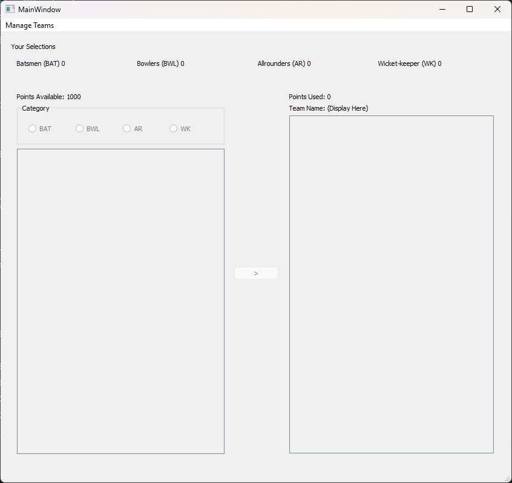
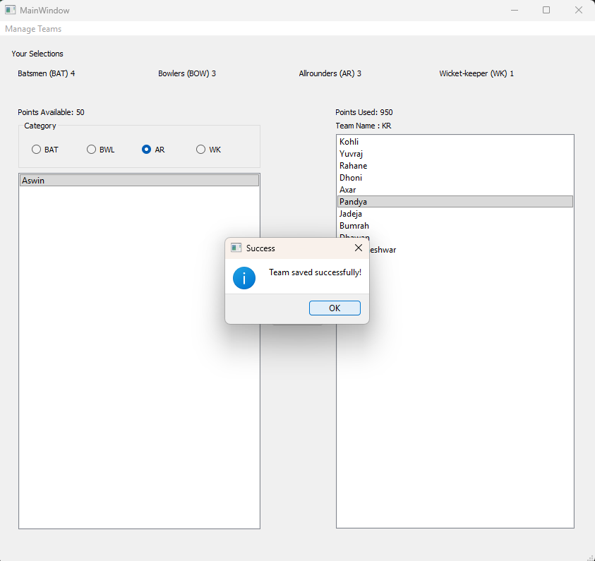
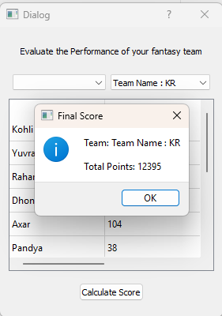

# Fantasy Cricket Team Management Application

A desktop application built using Python, PyQt5, and SQLite.

## Features
- Player category constraints (BAT, BWL, AR, WK)
- Points budget validation
- Team save to database
- Score evaluation logic
- GUI built using PyQt5

## Tech Stack
- Python
- PyQt5
- SQLite3
- SQL (CRUD operations)

## Screenshots

### Main Interface

### Team Saved Confirmation

### Score Evaluation

## Author
Karthick Raja
